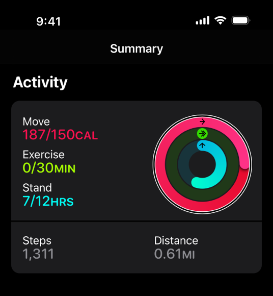

.. raw:: html

   

3️⃣ Alternative (alt) text ❌
::::::::::::::::::::::::::::::::

---------------------------
Alt text and its importance
---------------------------

How do people with blindness or poor vision experience websites when they are unable to visually see content?
A **screen reader** is an assistive technology that reads text aloud (or uses braille).
Screen readers rely on information being in text form.

But how are images and other non-text content communicated?
This brings us to alternative text or alt text for short.
For images to be accessible, the website must also contain a short text description of the image (up to 125 characters).
The alt text can then be read by the screen reader (although it is usually hidden for sighted readers).
Alt text is also important so it can be displayed if images fail to load and also for search engines to accurately understand image content.
This is another example of accessibility being good for everyone.

Although alt text can be written by developers or automatically generated by AI-based technologies, it is most accurate if specified early on by the designer.
It is best for the designer who chose the image to write its alt text as they understand the intent behind why the image was included.

-----------------------------------
Informative vs decorative images ❌
-----------------------------------

All images in websites are either informative or decorative.
Informative images communicate information to users and *must* have alt text to be accessible.
Decorative images are not used to communicate any information and only have aesthetic purposes and do *not* need alt text to be accessible
Screen readers skip reading decorative images aloud.
However, all images must be labelled either informative or decorative so screen readers know which to read aloud.

From the below screenshot, please answer the following questions:

.. image:: Images/informative-decorative.png
   :alt: Website screenshot with examples of informative and decorative images
   :width: 8cm
   :align: center

.. raw:: html

		  

          

		  
MCQ

                
Are the above images informative or decorative?

		<form name=Q1 id="Q1" data-component="design-practices">
		<input type="checkbox" id="Q1A1" value="correct"><label for="Q1A1">1 is informative, 2 is decorative</label>    		<input type="checkbox" id="Q1A2" value=""><label for="Q1A2">1 is decorative, 2 is informative</label>    
                <input type="button" value="Check" onclick="sendmcq('Q1')"> 
		</form>
		

	

	

-----------
Adee task 2
-----------

.. admonition:: Adee task 2

     Create alt text for an image.

     1. Select the image under Task 2
     2. Open the Adee plugin to "AltText Generator tool"
     3. Try to edit the related information of the image in the plugin
     4. Decide whether the image is informative or decorative
     5. If there are any further fields, fill them in
     6. Record the changes to the image information
     7. Close the plugin

.. raw:: html

   
 
   

   
Adee task rating

   Rate the difficulty of Adee task 2
   <form id = "C2" data-component="alt-text">
      Extremely difficult
   <input type="radio" name="C2" id="C2A1">
   <input type="radio" name="C2" id="C2A2">
   <input type="radio" name="C2" id="C2A3">
   <input type="radio" name="C2" id="C2A4">
   <input type="radio" name="C2" id="C2A5">
   Extremely easy
   <input type="button" value="Submit" onclick="sendlik('C2','alt-text')"> 
   </form>
   

   

-------------------------
Alt text can be difficult
-------------------------

Often writing good alt text is very difficult.
Charts, graphs and other data visualisations are particularly difficult to write good alt text for.

Above is a simple chart [#]_.
Appropriate alt text is: "Moving: 125 percent; Exercise: zero percent; Standing: 58 percent."

However, charts can be much more complicated than this to describe in alt text.
Generally, include a short description in the alt text with high level information about the chart, similar to a chart heading.
Then include a longer description with:

- the type of chart,

- a high-level summary of the data,

- trends and implications comparable to those available from the chart

Where possible, include this longer description in the shorter alt text.
Also where possible and practical, include a table with the actual data.

-----------
Adee task 3
-----------

.. admonition:: Adee task 3

     Create alt text for a chart.

     1. Select the chart image under Task 3
     2. Open the Adee plugin to "AltText Generator tool"
     3. Try to edit the related information of the image in the plugin
     4. Decide whether the image is informative or decorative
     5. If there are any further fields, fill them in
     6. Record the changes to the image information
     7. Close the plugin

.. raw:: html

   
 
   

   
Adee task rating

   Rate the difficulty of Adee task 3
   <form id = "C3" data-component="alt-text">
      Extremely difficult
   <input type="radio" name="C3" id="C3A1">
   <input type="radio" name="C3" id="C3A2">
   <input type="radio" name="C3" id="C3A3">
   <input type="radio" name="C3" id="C3A4">
   <input type="radio" name="C3" id="C3A5">
   Extremely easy
   <input type="button" value="Submit" onclick="sendlik('C3','alt-text')"> 
   </form>
   

   

.. raw:: html

   
 
   

   
Knowledge self-rating

   How well do you understand alt text?
   <form id = "C4" data-component="alt-text">
      Never heard of it
   <input type="radio" name="C4" id="C4A1">
   <input type="radio" name="C4" id="C4A2">
   <input type="radio" name="C4" id="C4A3">
   <input type="radio" name="C4" id="C4A4">
   <input type="radio" name="C4" id="C4A5">
   Could explain it to a friend
   <input type="button" value="Submit" onclick="sendlik('C4','alt-text')"> 
   </form>
   

   

.. [#] `Apple (2023) <https://developer.apple.com/design/human-interface-guidelines/accessibility#Content-descriptions>`_
