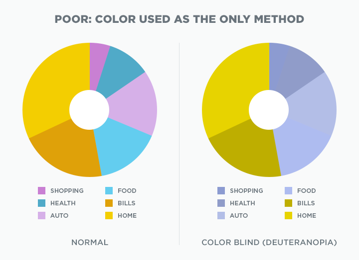
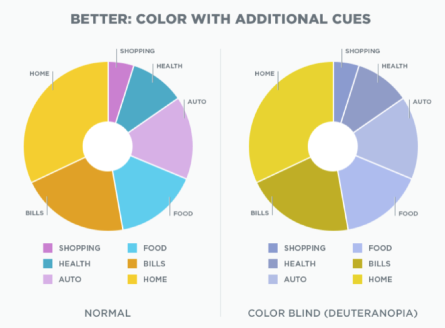

.. raw:: html

   

Colour blindness
::::::::::::::::::::::::

What is colour blindness?
People with colour blindness are either unable to see some colours or distinguish between some colours.
Around 1 in 12 men (8%) and 1 in 200 women in Australia are colour-blind.
The cause of colour blindness is usually genetic although some diseases or drugs can also be causes.

There are **different types** of colour blindness.
Have a look at the following image.

Below shows how people with different types of colour blindness would perceive the same image.

From left to right, the corresponding colour blindness types are: deuteranopia, protoanopia, tritanopia, and achromatopsia.
We will learn more about each of these and more shortly.

TODO: Have a look at the different colourblind modes in Adee's colour blindness simulator.

.. raw:: html

          

                
Not including "Normal", how many types of colour blindness do you see to choose from? <input type="text" id="Q1" data-component="colour-blindness">

                <button type="button" onclick="sendfitb('Q1')">Check</button>
		
	
 

	

From this number, there are 4 types of colour blindness that are *relatively mild*:

:Deuteranomaly:
    Type of red-green colour blindness.
    Most common form of colour blindness.
:Protanomaly:
    Another type of red-green colour blindness.
:Tritanomaly:
    Type of blue-yellow colour blindness.
    Less common than the above two red-green colour blindness types.
:Achromatomaly:
    Some deficiency in all colours.
    Rarest type of colour blindness.

You might notice that the remaining 4 types are related to each of these milder forms.
The remaining 4 types have the suffix "-opia" or "-opsia" instead of "-omaly" like the milder types.
These remaining types are complete deficiencies.
So, people with deuteranopia and protoanopia have complete red-green colour blindness so they cannot tell the difference between those colours at all.
People with tritanopia have complete blue-yellow colour blindness so they cannot tell the difference between blue and green, purple and red, and yellow and pink.
People with achromatopsia/monochromacy are unable to see any colour at all.
Achromatopsia is extremely rare.

.. raw:: html

          

                
To test a web design for the most common type of colour blindness, I would test for...

		<form name=Q2 id="Q2" data-component="colour-blindness">
		<input type="checkbox" id="Q2A1" value=""><label for="Q2A1">Tritanomaly, a type of red-green colour blindness.</label>    		<input type="checkbox" id="Q2A2" value="correct"><label for="Q2A2">Deuteranomaly, a type of red-green colour blindness.</label>    		<input type="checkbox" id="Q2A3" value=""><label for="Q2A3">Tritanomaly, a type of blue-yellow colour blindness.</label>    		<input type="checkbox" id="Q2A4" value=""><label for="Q2A4">Deuteranomaly, a type of blue-yellow colour blindness.</label>    
                <input type="button" value="Check" onclick="sendmcq('Q2')"> 
		</form>
		

	

What implications does colour blindness have for design?

As mentioned previously, it's important to not only use colour to communicate key information.
Otherwise people with colour blindness miss key information.
An example of this is below.
Notice how people with deuteranopia would find it difficult to use the key and only see 4 categories in the chart rather than 6.

But this doesn't mean that colour must be avoided entirely.
Instead, use other indicators as well as colour such as spacing, borders, patterns, and labels.
Below is an improved version of the same chart.

`Next page: Colour contrast <6-colour-contrast.html>`_
